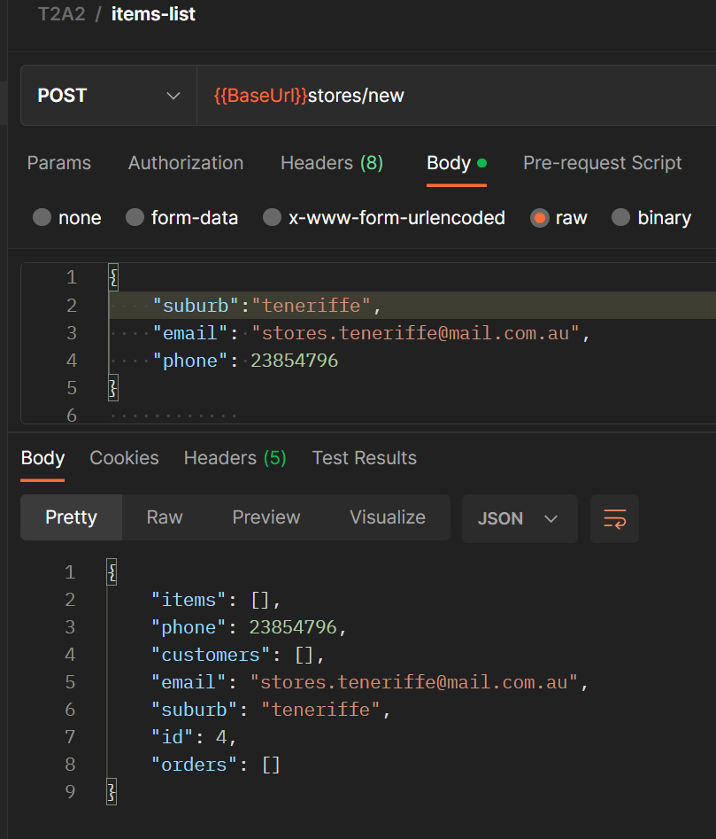

# DylanDavidson_T2A2 -  API Webserver  
  
[Github repository](https://github.com/Cheese-steak-jimmys/T2A2)  

## Description
### Grocery store and its needs  

For this exercise, there is an 'ACME Grocery Stores' that is a trading and growing business with DBMS needs.  

Like other retailers, ACME's core business model is to source desirable goods on a wholesale level to create an inventory and sell items at competitive retail prices to potential customers.  

The store requires a system to manage its data with added details for practicality.  
The main data types (tables/models) to be stored are:  

* Items
(ID, Brand, Description, Department, Price, Inventory, promotion)
  
* Customer/Clientele (users)  
(ID, Name, Email, Address, Phone, Membership)  

* Orders
(ID, Date, Customer_ID, Item_ID, Delivery, Order_total)

* Stores  
(ID, Email, Suburb/location, Phone)

__________________________________

## Why does this problem need solving?

Even before ACME had experienced exponential growth, it had an issue that if left unsolved, would be disastrously damaging to its reputation and ability to trade.  
  
Without a DBMS, ACME would not know enough about its inventory.  
How many units were sold? How much do they need to order? Do they have items X, Y, or Z? Which stores are underperforming?

Customers would be driven away by the inconvenience of purchasing items that are not in stock to fulfil orders and without a client DB, they would have to give their details at every transaction. It's not a great customer experience.
  
A database would greatly assist with designating orders to customer details and distinguish orders that are completed and yet to be fulfilled.  
__________________________________  

## Why choose PostgreSQL as the database system?  
  
PostgreSQL was chosen for this project because it is the DBMS that we have be learning. Although, it was a good choice for the needs of this problem.  
  
Projects with lesser DB needs could be serviced by a single file connected to a database, but alas, the grocery store's problem required the creation of several tables with relationships in a database.  

PostgreSQL has the scope for Model-View-Controller (MVC) which is what was used to make different modules out of the required tables.  
  
As ACME is a growing business with growing a database, using MVC methods was more practical for its needs, as it divides the data with more structure.  
  
Using PostgreSQL, ACME can expand its DB and create new models to meet more of its needs. (Eg. employees, logistics, contractors, financials, etc.)  
  
### Drawbacks of postgreSQL  

* More application support other DBMS, like MySQL.
* PostgreSQL has a slower performing speed than others, which may be undesirable.
* It is an older system and approaching its end-of-life, prompting the use of newer systems like AWS.  
* Support is primarily in english and may hinder diverse workspaces.  
  
_______________________________  
  
## Identify and discuss the key functionalities and benefits of an ORM  
  
Object-Relational-Mapper is essentially a nexus for developers to give commands and query an SQL database.  
  
Devs tend to be more versed in other systems than SQL and ORM lets them communicate with a preferred language of choice, like python or JS.  
  
Using ORMs can arguably be seen as a crutch in the DB development world because it lets programmers lean on it too often and can withhold the deeper learning of the SQL language itself.
  
From a first-hand point of view, in my API webserver project, I chose to use Python3 to communicate with the PostgreSQL grocery_store database.  

Here is an example of creating a table in SQL:
  
```bash  
                                                    CREATE TABLE empoloyee_details (
                                                    employee_id int primary key,
                                                    name varchar(100) NOT NULL, 
                                                    department varchar(20) NOT NULL
                                                    );
```  
  
Here is an ORM example of the same function in python, where you can add a blueprint and multiple fields at once.
```python  
                                                    from flask import Blueprint  

                                                    db_commands = Blueprint("db", __name__)


                                                    @db_commands.cli.command("create")
                                                    def create_db():
                                                    db.create_all()
                                                    print("Tables created")
```  
____________________________________________________  

Document all endpoints for your API  
  
_____________________________________________________  

### Grocery Store - Entity Relationship Diagram


____________________________________  
  
## Detail any third party services that your app will use  
  
The application does not utilise any third party services. Perhaps one day, ACME Grocery Stores will hire me to add a third party service to enhance their user experience.
  
____________________________________  
  
## Describe your projects models in terms of the relationships they have with each other  
  
The modules have connections to one another where data from one module is related to another, as shown in the ERD. The relations are represented by key data types, Primary(origin) and foreign(from another module):  
  
* The Stores module does not have a FK, only a primary key because that is where the the other modules content are domiciled to.  
There are several relations to and from the other modules that connect back to stores. 
  
* The customers module has the Stores FK to relate its data together.

* The Orders module has the most foreign keys (from all the other tables) and is the nexus for shared data.  
The primary purpose for the grocery_store DB was to create orders for customers and the module requires the most details to go into it.  

* The Items module has the Store FK within it to give the presence of an item to stores that carry it.  

______________________________________  
  
## Discuss the database relations to be implemented in your application  

The database tables have relationships appropriate for satisfying the problem of fulfilling orders by customers and general data storage. These are the relations from the top down:  
  
Stores => 
* Customers, Orders and Items back-populates stores to designate where customers are shopping, which store an order is to be fulfilled from and what items can purchased from a particular store.  
  
customers =>  
* Stores and Orders back-populate customers to show what orders have been made by an individual and where it was fulfilled.  

Orders =>
* Stores, Customers and Items back-populates Orders to relate an order to a location, a customer to an order and what item are in the order.   

### relationships - Orders  

  
________________________________________  
  
## Describe the way tasks are allocated and tracked in your project
  
Tasked are planned and tracked by using agile methods such as trello.  
I did have difficulty grasping some of the project aspects and restarted it with a fresh outlook.  
  
## Trello board

  
_______________________________  
  
## Endpionts
  
## GET ALL ORDERS  
  
  
## Auth Login  
  
  
## Create Store  
  
  
## Get One Item  
